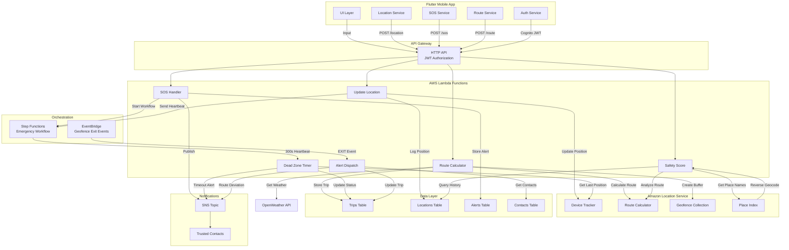

# ShadowTrace Architecture

## System Overview

ShadowTrace is a personal safety travel app that leverages AWS Location Service for real-time tracking, dead-zone detection, and emergency response. The system is built on a serverless architecture using Lambda, Step Functions, and Amazon Location Service.

## Data Flow Diagram



## Spatial Layer — Amazon Location Service

ShadowTrace replaces traditional PostGIS-based geospatial systems with AWS-native services:

### Core Services

1. **Device Tracker** (`shadowtrace-tracker`)
   - Real-time device position updates via `BatchUpdateDevicePosition`
   - Supports continuous location streaming
   - Queryable via `GetDevicePosition` for trusted contact monitoring

2. **Route Calculator** (`shadowtrace-route-calc`)
   - Esri datasource for routing
   - `CalculateRoute` returns polylines with leg geometry
   - Walking mode for pedestrian safety
   - Returns ETA in seconds

3. **Geofence Collection** (`shadowtrace-routes`)
   - Stores 200m buffer polygons around planned routes
   - EventBridge integration triggers on EXIT events
   - Enables automatic route deviation detection

4. **Place Index** (`shadowtrace-place-index`)
   - Reverse geocoding via `SearchPlaceIndexForPosition`
   - Labels waypoints for safety score analysis
   - Used in emergency reporting (e.g., "User left their route near Times Square")

## Dead Zone Detection Flow

```
Trip Start
    ↓
Location Updates (every 10s)
    ↓
Heartbeat → Step Functions (resets 300s timer)
    ↓
[Timeout After 300s No Heartbeat]
    ↓
Step Functions Catches HeartbeatTimeout
    ↓
Dead Zone Lambda Invoked
    ↓
Get Last Known Position from ALS Tracker
    ↓
Publish SNS Alert + Update Trip Status
    ↓
Notify Trusted Contacts
```

## Authentication

- **Provider**: Amazon Cognito User Pool
- **Tokens**: ID token (JWT) for API authentication
- **Flow**: Mobile app obtains JWT → Includes in Authorization header
- **API Gateway**: Validates JWT before routing to Lambda

## Data Schema

### Trips Table (shadowtrace-trips)
```json
{
  "userId": "string (PK)",
  "tripId": "string (SK)",
  "originLat": "number",
  "originLng": "number",
  "destLat": "number",
  "destLng": "number",
  "polyline": "array<[lng, lat]>",
  "eta": "number (seconds)",
  "hazardFlag": "boolean",
  "weather": "string",
  "geofenceId": "string",
  "status": "ACTIVE|DEVIATION|DEAD_ZONE_ALERT|COMPLETED",
  "taskToken": "string (for Step Functions)",
  "createdAt": "ISO8601"
}
```

### Locations Table (shadowtrace-locations)
```json
{
  "tripId": "string (PK)",
  "timestamp": "ISO8601 (SK)",
  "userId": "string",
  "lat": "number",
  "lng": "number",
  "speed": "number (m/s, optional)",
  "heading": "number (degrees, optional)"
}
```

### Alerts Table (shadowtrace-alerts)
```json
{
  "alertId": "string (PK)",
  "userId": "string",
  "lat": "number",
  "lng": "number",
  "timestamp": "ISO8601",
  "status": "ACTIVE|RESOLVED|EXPIRED"
}
```

## Key Design Decisions

1. **Serverless**: No EC2/RDS — all compute via Lambda, storage via DynamoDB
2. **Event-Driven**: EventBridge captures geofence exits automatically
3. **Stateless Lambdas**: Each function is independent; state stored in DynamoDB
4. **JWT over API Keys**: Cognito provides user context automatically
5. **Step Functions for Orchestration**: Native support for long-running workflows (300s dead zone)
6. **ALS over PostGIS**: Managed service, no database maintenance, native SigV4 signing for map tiles

## Deployment

Infrastructure as Code via CloudFormation (`backend/infra/shadowtrace_full_stack.yaml`):
- All resources tagged with `Project:ShadowTrace` and `Environment:dev|prod`
- DynamoDB tables have `DeletionPolicy: Retain` for data safety
- Cognito User Pool enforces password policies (8+ chars, upper, lower, number)
- API Gateway stages: `dev`, `prod`

## Monitoring & Observability

- Lambda logs → CloudWatch Logs (included in execution role)
- Step Functions → CloudWatch Metrics (execution history visible in console)
- DynamoDB → CloudWatch Alarms on throttling/errors
- API Gateway → CloudWatch Logs for requests/responses
